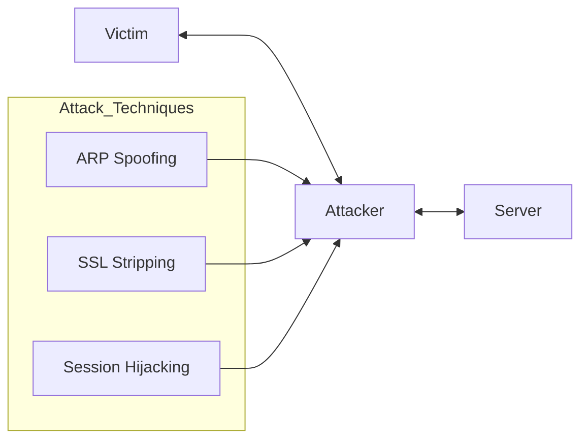

# 🕵️ Man-in-the-Middle (MITM) Attacks

[Back to Network Security](../README.md)

## 📖 Description
A Man-in-the-Middle (MITM) attack occurs when an attacker secretly intercepts and potentially alters the communication between two parties who believe they are directly communicating with each other. This is one of the most dangerous network attacks as it can lead to data theft, credential compromise, and session hijacking.

## 🎯 Attack Types

### 1. ARP Spoofing/Poisoning
- Manipulates ARP tables to associate attacker's MAC with legitimate IP
- Enables interception of local network traffic
- Most common in LAN environments

### 2. DNS Spoofing
- Corrupts DNS cache to redirect traffic to malicious sites
- Users believe they're visiting legitimate websites
- Can lead to phishing and malware distribution

### 3. SSL Stripping
- Downgrades HTTPS connections to HTTP
- Exploits the transition from HTTP to HTTPS
- Uses tools like SSLstrip to modify secure requests

### 4. Session Hijacking
- Steals session cookies to impersonate users
- Often combined with ARP spoofing
- Bypasses authentication mechanisms

### 5. Wi-Fi Eavesdropping
- Rogue access points
- Evil twin attacks
- Packet sniffing on open networks

## 🔍 Detection Methods

### Network-Level Detection
- **ARP Table Monitoring**: Detect unusual ARP changes
- **Traffic Analysis**: Identify suspicious patterns
- **Latency Checks**: Unusual delays in communication
- **Certificate Validation**: Check for invalid certificates

### Detection Scripts
- [ARP Spoof Detector](./detection/arp_spoof_detector.py) - Detects ARP poisoning attacks
- [SSL Strip Detector](./detection/ssl_strip_detector.py) - Identifies SSL downgrade attacks

## 🛡️ Prevention Strategies

### Network Level
1. **Static ARP Entries** - Prevent ARP spoofing
2. **Port Security** - Limit MAC addresses per port
3. **VLAN Segmentation** - Isolate sensitive traffic
4. **802.1X Authentication** - Network access control

### Application Level
1. **HSTS (HTTP Strict Transport Security)** - Enforce HTTPS
2. **Certificate Pinning** - Validate server certificates
3. **TLS 1.3** - Use modern encryption protocols
4. **Secure Cookies** - HttpOnly, Secure flags

### Prevention Scripts
- [SSL/TLS Configuration](./prevention/ssl_tls_config.py) - Secure server configuration
- [Certificate Pinning](./prevention/certificate_pinning.py) - Certificate validation examples

## 📊 Attack Flow


## 🔧 Common MITM Tools (Educational Only)

| Tool | Purpose | Detection Method |
|------|---------|------------------|
| Ettercap | ARP spoofing, packet filtering | ARP table monitoring |
| BetterCAP | Comprehensive MITM framework | Network analysis |
| SSLstrip | HTTPS downgrade | HSTS, certificate validation |
| Wireshark | Packet capture and analysis | Traffic inspection |
| Responder | LLMNR/NBT-NS poisoning | Protocol analysis |

## 💡 Best Practices

### For Network Administrators
```bash
# Monitor ARP table regularly
arp -a

# Enable port security on switches
switch(config-if)# switchport port-security
switch(config-if)# switchport port-security maximum 2

# Use DHCP snooping
ip dhcp snooping
ip dhcp snooping vlan 1-100
```
### For Web Developers
```javascript
// Enable HSTS
res.setHeader('Strict-Transport-Security', 
    'max-age=31536000; includeSubDomains; preload');

// Secure cookies
res.cookie('sessionId', token, {
    httpOnly: true,
    secure: true,
    sameSite: 'strict'
});
```

# 🛡️ Man-in-the-Middle (MITM) Awareness & Detection

## 👤 For End Users

- **Check for HTTPS** (look for the padlock icon in the browser address bar)
- **Verify certificates** (click the padlock to inspect issuer and validity)
- **Avoid public Wi-Fi** or use a trusted VPN
- **Keep software updated** (operating system, browser, firmware)
- **Use browser security extensions** (HTTPS enforcement, script/script-blocking tools)

---

## 📝 Detection Indicators

### 🔎 ARP Spoofing Signs

- Duplicate IP addresses in ARP table  
- Sudden changes in MAC-IP mappings  
- Increased network latency  
- Packet loss anomalies  

### 🔎 SSL Stripping Signs

- HTTP instead of HTTPS  
- Missing padlock icon  
- Certificate warnings  
- Mixed content warnings  

---

## ⚠️ Legal Warning

Only perform Man-in-the-Middle (MITM) testing on infrastructure you own **or** where you have explicit written authorization.

Unauthorized interception of communications is illegal in most jurisdictions and may constitute a criminal offense.

---

## 📚 References

- [OWASP – Man-in-the-Middle (MITM)](https://owasp.org/)
- ARP Spoofing Detection Techniques
- HSTS (HTTP Strict Transport Security) & HSTS Preload
- Certificate Pinning
