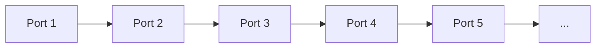
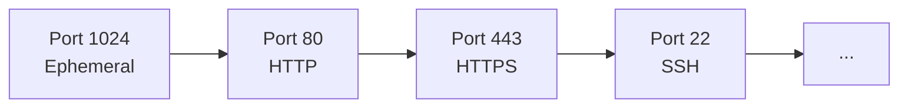
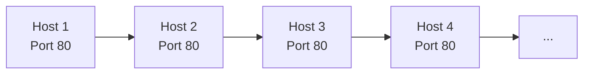

# 🔍 Port Scanning

[Back to Network Security](../README.md)

## 📖 Description
Port scanning is the process of probing a server or host for open ports. While network administrators use port scanning to verify security policies, attackers use it as a reconnaissance technique to identify potential entry points into a system.

## 🎯 Attack Types

### 1. TCP Connect Scan
- Completes full TCP handshake
- Easy to detect but reliable
- Most common scanning method

### 2. SYN Scan (Half-Open)
- Only sends SYN packet, never completes handshake
- Stealthier than full connect
- Requires root privileges

### 3. UDP Scan
- Probes UDP ports
- Slower and less reliable
- Based on ICMP responses

### 4. FIN/Null/Xmas Scans
- Uses unusual flag combinations
- Bypasses some firewalls
- Only works on some systems

### 5. ACK Scan
- Probes firewall rules
- Maps filtering rules
- Determines stateful filtering

### 6. Idle Scan
- Zombie host scanning
- Extremely stealthy
- Complex to execute

## 🔍 Detection Methods

### Network-Level Detection
- **Connection Logs**: Monitor connection attempts
- **Traffic Analysis**: Identify scanning patterns
- **Rate Limiting**: Detect excessive connections
- **Honeypots**: Trap and identify scanners

### Host-Level Detection
- **Port Monitoring**: Track connection attempts
- **Service Logs**: Analyze service access patterns
- **Resource Usage**: Monitor system load
- **Process Monitoring**: Detect scanning tools

### Detection Scripts
- [Port Scan Detector](./detection/port_scan_detector.py) - Real-time port scan detection
- [IDS Rules](./detection/ids_rules.txt) - Snort/Suricata rules for scan detection

## 🛡️ Prevention Strategies

### Firewall Configuration
1. **Rate Limiting** - Limit connection attempts
2. **Port Knocking** - Hide ports until sequence received
3. **IP Blacklisting** - Block suspicious IPs
4. **Geo-blocking** - Restrict by location
5. **Port Security** - Limit open ports

### System Hardening
1. **Close Unused Ports** - Minimize attack surface
2. **Run Services on Non-Standard Ports**
3. **Use Port Knocking** - Dynamic port access
4. **Implement Intrusion Prevention**
5. **Regular Audits** - Scan your own systems

### Prevention Scripts
- [Firewall Configuration](./prevention/firewall_config.py) - Automated firewall setup
- [Stealth Mode](./prevention/stealth_mode.py) - Port knocking implementation

## 📊 Scan Patterns

### Sequential Scan


### Random Scan



### Sweep Scan


## 🚨 Detection Indicators

### Signs of Port Scanning
- Multiple connection attempts from same IP
- Connections to sequential ports
- Unusual protocol combinations
- Connections to closed ports
- Repeated SYN packets without ACKs
- Connections during odd hours

### Alert Thresholds
| Scan Type | Threshold | Time Window |
|-----------|-----------|-------------|
| TCP Connect | >10 ports | 1 minute |
| SYN Scan | >15 ports | 1 minute |
| UDP Scan | >5 ports | 1 minute |
| Sweep Scan | >5 hosts | 1 minute |

## 💡 Best Practices

### For Administrators
```bash
# Regular self-scanning
nmap -sS -sV -O localhost

# Monitor logs
tail -f /var/log/auth.log | grep "Failed password"

# Check open ports
netstat -tulpn | grep LISTEN

# Real-time monitoring
iftop -i eth0
```

## For Firewall Configuration
```bash
# Rate limit connections
iptables -I INPUT -p tcp --dport 22 -m state --state NEW -m recent --set
iptables -I INPUT -p tcp --dport 22 -m state --state NEW -m recent --update --seconds 60 --hitcount 5 -j DROP

# Port knocking example
iptables -N KNOCKING
iptables -A INPUT -m recent --name KNOCK1 --rcheck --seconds 10 -j KNOCKING
```

# 🔐 System Hardening & Scanning Awareness

## 🛡️ System Hardening

- **Minimal Installation** – Install only required services and packages
- **Regular Updates** – Patch operating systems, applications, and firmware
- **Security Groups / Firewall Rules** – Restrict inbound and outbound access
- **Monitoring** – Log all connections and authentication attempts
- **Incident Response Plan** – Establish documented response and escalation procedures

---

## 🔧 Common Scanning Tools (Educational Only)

| Tool | Purpose | Detection Method |
|------|----------|-----------------|
| Nmap | Comprehensive network scanner | Pattern-based detection (IDS/IPS signatures) |
| Masscan | High-speed port scanning | Rate-based anomaly detection |
| Zmap | Internet-wide scanning | Traffic volume monitoring |
| Unicornscan | Asynchronous port scanning | Connection state tracking |
| Hping | Custom packet crafting | Protocol and packet anomaly analysis |

---

## ⚠️ Legal Notice

Use scanning tools only on systems you own or where you have explicit written authorization. Unauthorized scanning may violate laws, service agreements, or organizational policy.

## 📝 IDS/IPS Rules Examples
### Snort Rules
```text
# Detect Nmap TCP scan
alert tcp $EXTERNAL_NET any -> $HOME_NET any (msg:"NMAP TCP Scan"; \
    flags:S; detection_filter:track by_src, count 50, seconds 10; \
    sid:1000001; rev:1;)

# Detect SYN scan
alert tcp $EXTERNAL_NET any -> $HOME_NET any (msg:"SYN Scan Detected"; \
    flags:S; threshold:type both, track by_src, count 20, seconds 5; \
    sid:1000002; rev:1;)
```
### Fail2ban Configuration
```text
[port-scan]
enabled = true
port = all
filter = port-scan
logpath = /var/log/syslog
maxretry = 10
bantime = 3600
findtime = 60
```
## 📚 References

- [Nmap Network Scanning](https://nmap.org/book/)
- [OWASP](https://owasp.org/)
- Port Scanning Techniques (various academic and security research sources)
- [Snort Rules Documentation](https://docs.snort.org/)
