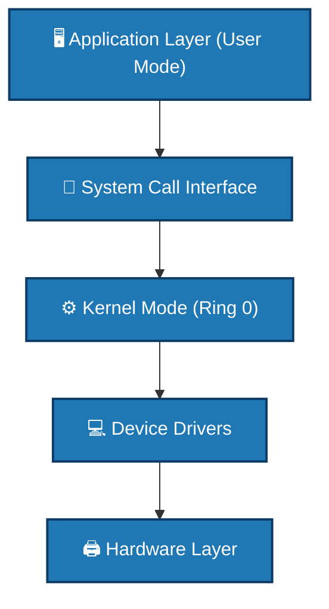

# 👻 Rootkits

[Back to Malware Analysis](../README.md)

## 📖 Description
A rootkit is a collection of malicious software designed to provide unauthorized access to a computer while hiding its presence. Rootkits operate at the deepest levels of the operating system, modifying kernel components, system calls, and core system functions to remain undetected.

## 🎯 Types of Rootkits

### 1. User-Mode Rootkits
- Run at application level
- Intercept Windows APIs
- Modify DLLs and user-space libraries
- Examples: HackerDefender, Vanquish

### 2. Kernel-Mode Rootkits
- Run at operating system core
- Modify kernel code and data structures
- Intercept system calls
- Extremely difficult to detect
- Examples: FU Rootkit, ShadowWalker

### 3. Bootkits
- Infect Master Boot Record (MBR)
- Load before operating system
- Survive OS reinstalls
- Examples: TDL4, Olmasco

### 4. Firmware Rootkits
- Infect hardware firmware
- BIOS/UEFI level
- Persist across disk formats
- Examples: LoJax, Mebromi

### 5. Virtualized Rootkits
- Run as hypervisors
- Host OS runs as virtual machine
- Examples: Blue Pill, SubVirt

### 6. Memory Rootkits
- Exist only in RAM
- No disk persistence
- Disappear on reboot
- Examples: Meterpreter, Memory implants

## 🔍 Detection Methods

### Signature-Based Detection
- Known rootkit patterns
- File hash matching
- Registry signatures
- Driver signatures

### Behavioral Detection
- Unusual system behavior
- Hidden processes
- Network anomalies
- Performance degradation

### Integrity Checking
- File system integrity
- Kernel code integrity
- System call table verification
- Memory forensics

### Detection Scripts
- [Rootkit Detector](./detection/rootkit_detector.py) - Comprehensive rootkit scanning
- [Integrity Checker](./detection/integrity_checker.py) - System integrity verification

## 🛡️ Prevention Strategies

### System Hardening
1. **Secure Boot** - Verify boot components
2. **Kernel Patching** - Keep kernel updated
3. **Driver Signing** - Only signed drivers
4. **Memory Protection** - DEP, ASLR
5. **Secure Configuration** - Minimize attack surface

### Prevention Scripts
- [Secure Boot](./prevention/secure_boot.py) - Boot security configuration
- [Kernel Patching](./prevention/kernel_patching.py) - Kernel update management

## 📊 Rootkit Architecture



## 🚨 Rootkit Indicators

### System Indicators
- Unexplained system crashes
- Blue screens/deadlocks
- Slow system performance
- Strange network activity
- Disabled security tools

### File System Indicators
- Hidden files/directories
- System file modifications
- Unusual file timestamps
- Alternate Data Streams (NTFS)
- Driver files in odd locations

### Process Indicators
- Hidden processes
- Processes with no parent
- Impossible process paths
- Process injection signs

### Registry Indicators (Windows)
- Hidden registry keys
- Service modifications
- Driver autostart entries
- Image execution options

## 💡 Detection Techniques

### 1. Cross-View Detection
```python
# Compare system views
api_view = GetProcessListViaAPI()
raw_view = ScanProcessMemory()
hidden = raw_view - api_view  # Hidden processes
```

### 2. Signature Scanning
```python
# Known rootkit patterns
patterns = [
    "\\\\.\\procfs\\",  # FU Rootkit
    "nt!KiTrap0D",       # Stuxnet
    "\\Driver\\TDL"      # TDL4
]
```
### 3. Integrity Checking
```python
# Verify system files
system_files = [
    "ntoskrnl.exe",
    "hal.dll",
    "kernel32.dll",
    "ntdll.dll"
]
```

## 🛠️ Rootkit Analysis Tools

| Tool             | Purpose                  | Platform        |
|-----------------|--------------------------|----------------|
| GMER             | Rootkit detection        | Windows        |
| RootkitRevealer  | Rootkit scanning         | Windows        |
| chkrootkit       | Linux rootkit detection  | Linux          |
| rkhunter         | Rootkit hunter           | Linux          |
| Volatility       | Memory forensics         | Cross-platform |
| WinDbg           | Kernel debugging         | Windows        |

---

## 📝 Known Rootkit Examples

| Name       | Type        | Target   | Detection Method          |
|------------|------------|---------|--------------------------|
| FU Rootkit | Kernel     | Windows | SSDT hook detection       |
| TDL4       | Bootkit    | Windows | MBR analysis              |
| Stuxnet    | Kernel     | Windows | Driver signing            |
| Blue Pill  | Virtualized| Windows | Hypervisor detection      |
| LoJax      | Firmware   | UEFI    | NVRAM scanning            |

---

## ⚠️ Critical Warning

> ⚠️ **EXTREME DANGER:** Rootkit analysis is one of the **most dangerous forms of malware analysis**!

- ❌ NEVER analyze rootkits on production systems  
- ✅ ALWAYS use dedicated **air-gapped machines**  
- 🚫 DISABLE all network interfaces  
- 💾 USE **hardware-level isolation**  
- 👀 MONITOR for VM escape attempts  
- 🔥 DESTROY analysis environment after use  

---

## 📚 References

- [Rootkit (Wikipedia)](https://en.wikipedia.org/wiki/Rootkit)  
- [SANS Rootkit Analysis](https://www.sans.org/white-papers/321/)  
- *Unmasking Rootkits*  
- *Rootkit Detection Techniques*  
- [Volatility Foundation](https://www.volatilityfoundation.org/)
