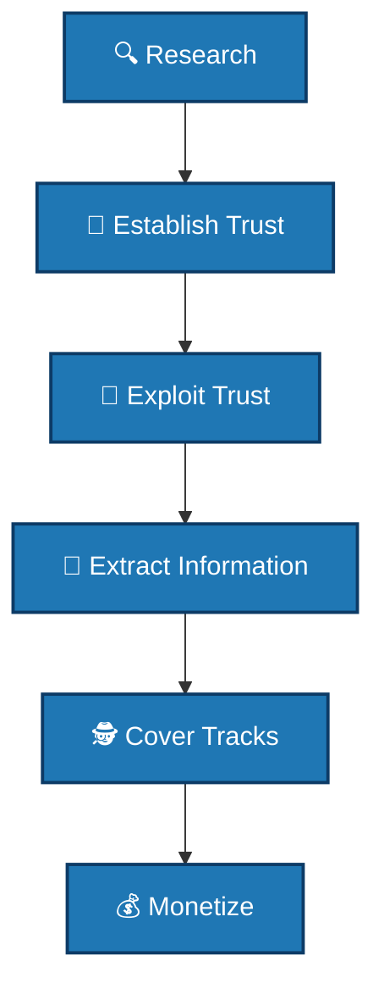

# 🎭 Social Engineering

[Back to Main](../README.md)

## 📖 Overview
Social engineering is the psychological manipulation of people into performing actions or divulging confidential information. Unlike technical hacking, social engineering targets the human element—often considered the weakest link in security.

## 📋 Categories Covered

1. [Phishing](./phishing/README.md) - Deceptive emails and messages
2. [Pretexting](./pretexting/README.md) - Fabricated scenarios to steal information
3. [Baiting](./baiting/README.md) - Offering something enticing to deploy malware
4. [Tailgating](./tailgating/README.md) - Following authorized personnel into restricted areas
5. [Quid Pro Quo](./quid-pro-quo/README.md) - Offering a service in exchange for information
6. [Vishing](./vishing/README.md) - Voice phishing over phone calls
7. [Smishing](./smishing/README.md) - SMS/text message phishing

## 🛡️ Social Engineering Attack Vectors

| Type | Vector | Target | Success Rate |
|------|--------|--------|--------------|
| Phishing | Email | Credentials | High |
| Spear Phishing | Targeted Email | Specific Individuals | Very High |
| Whaling | Executive Email | C-Level Executives | Critical |
| Vishing | Phone Call | Information | Medium |
| Smishing | SMS | Credentials | Medium |
| Pretexting | In-Person/Phone | Information | High |
| Baiting | USB Drops/Downloads | System Access | Medium |
| Tailgating | Physical Entry | Building Access | High |

## 🔍 Detection Methods

### Technical Detection
- Email filtering and analysis
- URL reputation checking
- Domain spoofing detection
- Attachment sandboxing
- Behavioral analytics

### Human Detection
- Security awareness training
- Phishing simulations
- Reporting mechanisms
- Verification protocols

### Detection Scripts
- [Phishing Detector](./phishing/detection/phishing_detector.py) - Email analysis
- [Email Analyzer](./phishing/detection/email_analyzer.py) - Header and content analysis
- [Social Engineering Detector](./pretexting/detection/social_engineering_detector.py) - Call/sms analysis

## 🛡️ Prevention Strategies

### Technical Controls
1. **Email Authentication** - SPF, DKIM, DMARC
2. **Web Filtering** - Block malicious sites
3. **Multi-Factor Authentication** - Prevent credential abuse
4. **Endpoint Protection** - Block malware downloads
5. **Data Loss Prevention** - Monitor sensitive data

### Administrative Controls
1. **Security Policies** - Clear guidelines
2. **Incident Reporting** - Easy reporting channels
3. **Regular Audits** - Test security awareness
4. **Vendor Management** - Third-party risk

### Educational Controls
1. **Security Awareness Training** - Regular sessions
2. **Phishing Simulations** - Test employees
3. **Posters and Reminders** - Visual cues
4. **Newsletters** - Latest threats

### Prevention Scripts
- [Training Materials](./phishing/prevention/training_materials.md) - Educational content
- [Email Filters](./phishing/prevention/email_filters.py) - Spam/phishing filtering
- [Security Policy](./pretexting/prevention/security_policy.md) - Policy templates

## 📊 Social Engineering Attack Cycle



## 🚨 Common Social Engineering Techniques

### 1. Authority
- Posing as IT support
- Fake law enforcement
- Impersonating executives

### 2. Urgency
- "Your account will be locked"
- "Immediate action required"
- "Limited time offer"

### 3. Scarcity
- "Only 5 spots left"
- "Exclusive offer"
- "Limited quantities"

### 4. Familiarity
- Impersonating colleagues
- Fake social media friends
- Compromised accounts

### 5. Trust
- Building rapport
- Shared interests
- Fake reviews/testimonials

## 💡 Best Practices

### For Employees
```markdown
# Social Engineering Defense Checklist

□ Verify unexpected requests through alternate channels
□ Never share passwords or OTPs
□ Hover over links before clicking
□ Check sender email addresses carefully
□ Be wary of unsolicited attachments
□ Report suspicious communications immediately
□ Use MFA everywhere possible
□ Lock your screen when away
□ Challenge unknown visitors
□ Follow data classification policies
```

### For Organizations
```bash
# Implement email authentication
SPF: v=spf1 include:_spf.google.com ~all
DKIM: Enable signing for all outgoing mail
DMARC: p=quarantine; rua=mailto:reports@domain.com

# Deploy phishing simulation
# Use tools like GoPhish or LUCY
```

## 📝 Social Engineering Indicators

### 📧 Email Red Flags
- Urgent or threatening language  
- Generic greetings (e.g., "Dear Customer")  
- Misspellings and poor grammar  
- Mismatched URLs  
- Unexpected attachments  
- Requests for credentials  
- Unusual sender addresses  

### 📞 Phone Call Red Flags
- Caller ID spoofing  
- Pressure to act immediately  
- Requests for personal info  
- Unsolicited tech support  
- Prize/sweepstakes wins  
- Demands for payment  

### 🏢 Physical Red Flags
- No visible ID badge  
- Vague purpose for visit  
- Asking to borrow equipment  
- Following through secure doors  
- Loitering in restricted areas  

---

## 🔧 Social Engineering Tools (Defensive)

| Tool      | Purpose                  | Type          |
|-----------|--------------------------|---------------|
| GoPhish   | Phishing simulations     | Open Source   |
| LUCY      | Security awareness       | Commercial    |
| PhishMe   | Training platform        | Commercial    |
| Mimecast  | Email security           | Commercial    |
| Proofpoint| Threat protection        | Commercial    |
| KnowBe4   | Training platform        | Commercial    |

---

## 📚 References

- *Social Engineering Framework*  
- [NIST SP 800-61](https://csrc.nist.gov/publications/detail/sp/800-61/rev-2/final)  
- *SANS Security Awareness*  
- *APWG Phishing Reports*  
- [CISA Phishing Guidance](https://www.cisa.gov/stop-phishing)
