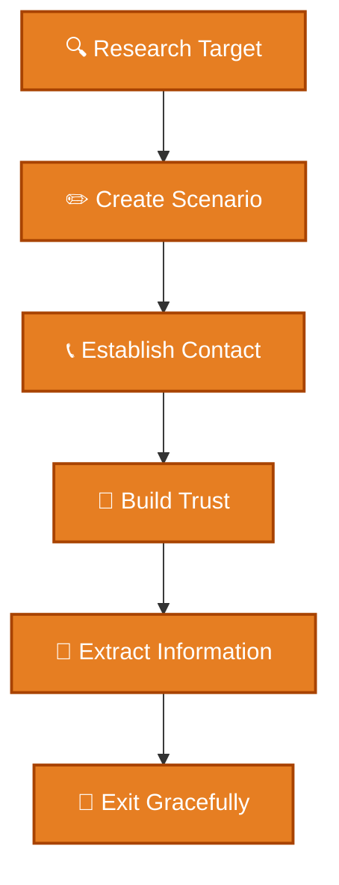

# 🎭 Pretexting

## 📖 Description
Pretexting is a form of social engineering where attackers create a fabricated scenario (pretext) to steal information or gain access. Unlike phishing which uses technical deception, pretexting relies on building a false sense of trust through impersonation and elaborate stories.

## 🎯 Types of Pretexting

### 1. Impersonation
- Posing as IT support
- Fake law enforcement
-冒充 executives
- Vendor impersonation

### 2. Research Surveys
- Fake market research
- Academic studies
- Customer satisfaction surveys
- Political polling

### 3. Charity Scams
- Fake disaster relief
- Fundraising for fake causes
- Religious organization scams
- Crowdfunding fraud

### 4. Romance Scams
- Dating site manipulation
- Long-distance relationships
- Emergency money requests
- Gift card demands

### 5. Tech Support Scams
- Fake virus alerts
- Software update calls
- Account recovery assistance
- Warranty renewal scams

### 6. Government Impersonation
- Fake IRS agents
- Social Security calls
- Immigration officers
- Court officials

## 🔍 Detection Methods

### Call Analysis
- Caller ID verification
- Voice pattern analysis
- Call-back verification
- Background noise analysis

### Story Verification
- Fact-checking claims
- Cross-referencing information
- Timeline analysis
- Consistency checking

### Detection Scripts
- [Social Engineering Detector](./detection/social_engineering_detector.py) - Call/sms analysis

## 🛡️ Prevention Strategies

### Technical Controls
1. **Call Authentication** - STIR/SHAKEN for calls
2. **Number Blocking** - Block known scam numbers
3. **Robocall Filtering** - Identify automated calls
4. **Voice Biometrics** - Speaker verification

### Administrative Controls
1. **Verification Protocols** - Always verify through official channels
2. **Information Classification** - Label sensitive data
3. **Need-to-Know Basis** - Limit information access
4. **Dual Authorization** - Require two approvals

### Prevention Scripts
- [Security Policy](./prevention/security_policy.md) - Policy templates

## 📊 Pretexting Attack Cycle



## 🚨 Pretexting Indicators

### Phone Call Red Flags

- ☑ Caller asks you to verify personal information  
- ☑ Unsolicited tech support calls  
- ☑ Caller claims to be from a government agency  
- ☑ Demands immediate payment  
- ☑ Requests payment via gift cards  
- ☑ Caller ID shows "Unknown" or a spoofed number  
- ☑ Background noise sounds like a call center  
- ☑ Scripted conversation with unnatural pauses  


### In-Person Red Flags
- ☑ No visible ID badge  
- ☑ Vague purpose for visit  
- ☑ Asks to borrow equipment  
- ☑ Too friendly or pushy  
- ☑ Inquires about security procedures  
- ☑ Shows up at unusual times  
- ☑ Claims an emergency situation  


## 💡 Best Practices

### Phone Call Verification
```markdown
# Phone Call Security Checklist

□ Never give out personal information to incoming calls
□ Hang up and call back using official number
□ Verify identity through multiple channels
□ Be wary of caller ID - it can be faked
□ Don't trust "verify your identity" requests
□ Government agencies never demand immediate payment
```

### In-Person Verification
```markdown
# Visitor Verification Checklist

□ Always ask for ID
□ Verify with the person they claim to represent
□ Escort visitors at all times
□ Report suspicious individuals
□ Don't hold doors for strangers
□ Challenge people in restricted areas
```

## 📝 Example Pretexting Scenarios
### Tech Support Scam

```text
Caller: "Hello, this is Microsoft Windows Support. We've detected
multiple viruses on your computer. I need you to install this software
to clean your system."

Victim: "I didn't report any problems."

Caller: "This is from our automated monitoring system. If you don't
act now, your computer will be disabled in 24 hours."
```
### IRS Impersonation
```text
Caller: "This is Officer Smith from the IRS. There's a warrant for
your arrest for tax evasion. You need to pay $5,000 immediately via
gift cards to avoid prosecution."

Victim: "That sounds serious."

Caller: "It is! But if you pay now, we can resolve this. Go to
Walgreens and buy $5,000 in Google Play gift cards. Call me back
with the codes."
```

### Charity Scam
```text
Caller: "Hi, I'm calling from the National Police Benevolent Association.
We're raising funds for families of fallen officers. Can you help?"

Victim: "I'd like to help."

Caller: "Thank you! We accept credit cards or bank transfers.
Let me take your information..."
```

## 🔧 Pretexting / Phone Scam Prevention Tools

| Tool                   | Purpose                    | Type       |
|------------------------|---------------------------|------------|
| Nomorobo               | Robocall blocking          | Service    |
| Truecaller             | Caller ID and spam blocking| App        |
| Hiya                   | Call protection            | App        |
| RoboKiller             | Spam call blocking         | App        |
| FTC Complaint Assistant | Report scams               | Government |

---

## 📚 References

- [FTC Avoiding Scams](https://www.consumer.ftc.gov/features/scam-alerts)  
- [FBI Common Scams](https://www.fbi.gov/scams-and-safety/common-scams-and-crimes)  
- [AARP Fraud Watch Network](https://www.aarp.org/money/scams-fraud/)  
- [Better Business Bureau Scam Tracker](https://www.bbb.org/scamtracker)  
