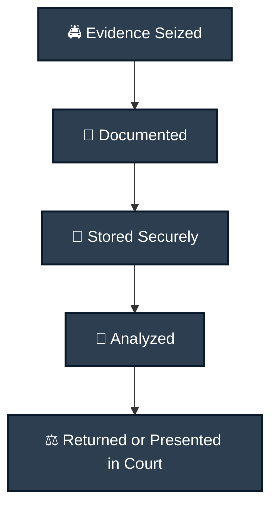
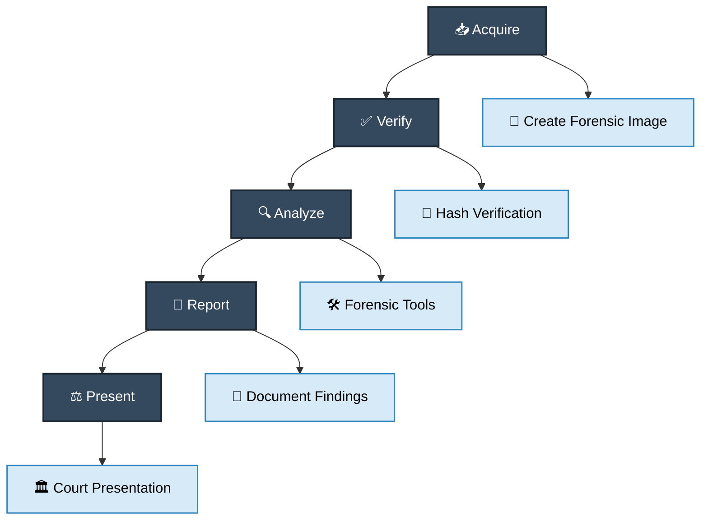

# 🔍 Digital Forensics

## 📖 Overview
Digital forensics involves the preservation, identification, extraction, documentation, and interpretation of computer media for evidentiary purposes and root cause analysis.

## 🎯 Types of Forensics

### 1. Memory Forensics (RAM)
- Running processes
- Network connections
- Open files
- Malware in memory
- Encryption keys

### 2. Disk Forensics
- Deleted files
- File system analysis
- Timeline analysis
- Hidden data
- Partition recovery

### 3. Network Forensics
- Packet capture
- Connection logs
- Traffic analysis
- Protocol analysis

### 4. Mobile Forensics
- Call logs
- Messages
- App data
- Location history

## 🛠️ Key Concepts

### Chain of Custody
## 🧾 Digital Forensics Evidence Workflow

### Write Blockers
- Hardware write blockers
- Software write blockers
- Prevents evidence tampering

### Imaging Types
- **Physical**: Bit-for-bit copy
- **Logical**: Files and folders only
- **Live**: Running system capture

## 📊 Forensic Workflow
## 🔬 Digital Forensics Process

## 💡 Best Practices

1. **Never work on original evidence**
2. **Document every keystroke**
3. **Use verified tools**
4. **Maintain integrity with hashes**
5. **Follow legal procedures**
